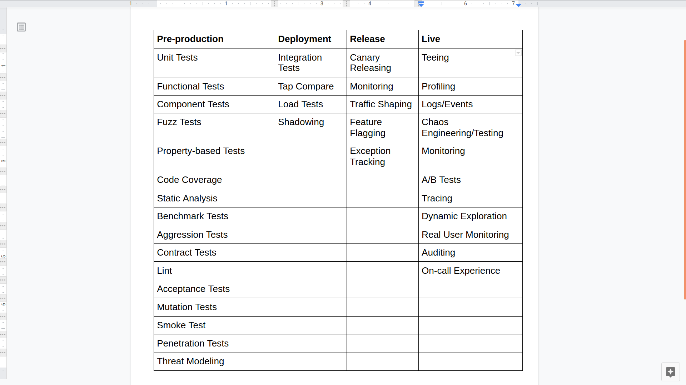

## 📜 Table of Contents
- **[Test Structures](#Section-1:-Test-Structures)**

  Optimal way on structuring test which is aiming for readability and maintainability.

- **[Back-end](#Back-end)**

  In this secion, we would share testing techniques outside the famous test pyramid (unit, integration and e2e). How micro-service architecture affects testing and what are the efficient way to test it.

- **[Testing  Microservices](#Testing-Microservices)**

- **[Chaos Engineering/Testing](https://github.com/ralphcasipe1/just-do-the-testing/tree/develop/chaos-engineering)**

  This section will talk about Chaos Engineering.

- **[Measuring test](#Measuring-test)**

  Measuring the quality of the implemented Tests

- **[CI](#CI)**

  Leveraging continuous testing for failing fast and continuous improvement

- **[Conclusion](#Conclusion)**

  My closing thoughts about the current state of testing techniques in todays era.

- **[Resources](#Resources)**

  My research materials that help me a lot when writing this.

- **[References](#References)**

  The citations I made when writing this.
____________

## ☯️ The Way of Testing
> 🌟 
>
> **"Test only as much as needed, strive to keep it nimble, sometimes it's even worth dropping some tests and trade reliability for agility and simplicity"**
>
> _-- Yoni Goldberg_

## Why write a test?

First of all anyone who has ever done manual testing knows that it's **slow**, **boring** and **error-prone**. 

By writing automated tests we are trying to remove -- or at the very least improve -- on these pain points.

We want to **move fast** and with confidence that things work. That's why tests should:
- _Give us confidence_ that the code does what it should.

- _Provide feedback_ that is **fast**, **accurate**, **reliable** and **predictable**.

- _Make maintenance easier_, this is something commonly overlooked when writing tests.

## 🏛️ Section 1: Test Structures

### Section 1.1: 3 Core Parts
Test structures could be differ depending on the unit under tests. 

There are some unit that we need to test which is straight up simple that we can use a simple assertions with no or minimal setup.

There are some unit we need to tests that have several methods.

There are also functions that are data-driven and therefore we need a technique called **Table-Driven Testing**.

Although, in any kind of situations there are **3 important parts** we need to uphold when testing a unit.

1. **What is being tested?**
  
    E.g., the `ProductRepository#add` method

2. **Under what circumstancess and scenario?**

    E.g., no price is passed to the method

3. **What is the expected result?**

    E.g., the new product is not approved.

### Simple Testing
```javascript
// (1.) What is being tested
describe('isOver18', function() {

  // (2.) Under what scenario
  describe('WHEN the age is under 18', function() {

    // (3.) Expected result
    it('should return false', function() {
      expect(isOver18({ age: 16 })).to.be.false;
    });
  });
});
```
1. The function we are testing is `isOver18`.

2. In this part, we define _when_ the passed argument is under 18. You can also structure the test by combining the `WHEN` keyword together with the assertion description. E.g:

    ```javascript
    it('should return false, when the age is under 18, ', function() { ... })
    ```
    
### Categorizing the tests via `Class#methods`
```javascript
// (1.) Unit under test
describe('ProductRepository', function() {

  // (2.) Category of the unit test
  describe('Add New Product', function() {

    // (3.) Pre-conditions, preparation
    describe('GIVEN no price is specified', function() {
      beforeEach(function() {
        this.product = { name: 'Kraker oots' };
      });

      // (4.) What scenario
      context('WHEN #add is called', function() {
        beforeEach(function() {
          this.newProduct = new ProductRepository().add({this.product});
        });

        // (5.) Expected Result
        it('should set the status as PENDING', function() {
          expect(this.newProduct.status).to.equals('PENDING')
        });
      });
    });
  });

  describe('Update Product', function() {
    describe('GIVEN no product found', function() {
      ...
      describe('WHEN #update is called', function() {
        ...
        it('should throw an error', function() {
          ....
        });
      });
    });
  });
});
```

1. The unit under tests is only `ProductRepository`.

2. Since `ProductRepository` have more than one methods, then we can categorize it via methods. In our case `Add New Product` and `Update Product` are the **categories**.

3. Some of the tests require pre-conditions to test certain results. We can describe it by starting with a keyword, `GIVEN`. In addition, we can also **prepare/setup** the requirements for this scenario.

4. In this part, we can use the requirements that we prepare in **(3.)** together with the function we need to test. In this case, we should start it with the **WHEN** keyword.

5. Lastly, we should define on **what to expect** when calling the functions _given_ those requirements we prepare and calling the function under certain cicumstances. In BDD, the assertion part is from the `THEN` keyword.

### Table-driven tests structure

```javascript
// (1.) What is being tested
describe('isEligibleToVote', function() {

  // (2.) Table-driven testing technique setup
  const tests = [
    {
      name: 'should return false, when age is under 18',
      input: { age: 17, naturalizationDate: new Date(), country: 'Philippines' },
      expected: false,
    },
    {
      name: 'should return false, when the naturalization date is null',
      input: { age: 18, naturalizationDate: null, country: 'Philippines' },
      expected: false,
    },
    {
      name: 'should return false, when the country is not equals to Philippines',
      input: { age: 18, naturalizationDate: new Date(), country: 'Brazil' },
      expected: false,
    },
    ...
  ];
  
  // (3.) Applying the table testing
  tests.forEach(test => {
    it(test.name, function() {
      expect(isEligibleToVote(test.input)).to.equals(test.expected)
    });
  });
});
```
1. The unit under test is `isEligibleToVote`
2. Here, we setup the table testing
    > **💡 TAKE NOTE**
    > 
    >  That **WE NEED** to name the test. So that later on, we could treat this as a clear-cut documentation for this function

> **⚠️ WARNING** 
>
> Table-driven testing is still unconventional in NodeJS environment YET. It also breaks the default convention of `eslint-plugin-mocha`. Fortunately, you can customize your `rules`.

### Further guidelines when structuring your tests

You could based the scenarios from the documentation requirements

1. **Based your test from the documentation requirements.** It might be written formally, or just communicated via email or Slack. Ask help from the QA or PM!

2. **Name your tests using the production language.** Naming your tests, most likely similar with the business' language requirements, using scenarios and expectation, will help correlate the code with the business expectations.

3. **Minimizes the communication gap between technical and non-technical people**. It is easy also for those people who didn't write code like the QA or people who have little knowledge about the feature like DevOps fellows and also the future YOU.


### Section 1.2: Structure your tests by the **AAA** pattern

> **A** - rrange
>
> _SETUP_ the test first, this could be under the `GIVEN` keyword.
> 
> **A** - ct
>
> _EXECUTE_ the unit under test, it can also use the variables that was being set up in `GIVEN` section
> 
> **A** - Assert
> 
> _VERIFY_  the result and make sure it satisfies the expectation

This will allow the reader or reviewer assess your code more easily.

**😞 BAD EXAMPLE**
```js
describe('Customer classifier', function() {
  it('should be classified as premium', function() {
    const customerToClassify = { 
      spend: 505, 
      joined: new Date(), 
      id: 1 
    };

    const DBStub = sinon.stub(dataAccess, 'getCustomer').reply({
      id: 1,
      classification: 'regular',
    });

    const actual = CustomClassifier.classify(customerToClassify);

    expect(actual).to.equals('premium');
  });
});
```

Although, the example is pretty straight forward on developer's point of view. It is quite horrible for non-technical people. **IT DOES NOT** state any kind of steps to replicate the expected result.

**🥳 THIS IS MUCH BETTER**
```js
describe('Customer classifier', function() {
  describe('GIVEN the classification is regular', function() {
    before(function() {
      this.customerToClassify = { spend: 505, joined: new Date(), id: 1 };

      sinon.stub(dataAccess, 'getCustomer').reply({
        id: 1,
        classification: 'regular',
      });
    });

    context('WHEN customer spent more than $500', function() {
      before(function() {
        this.receivedClassification = CustomClassifier.classify(this.customerToClassify);
      });

      it('should be classified as premium', function() {
        expect(this.receivedClassification).to.equals('premium');
      });
    });
  });
});
```

The test runner would output this eligibly thus increasing the readability for BOTH technical and non-technical people.

### Section 1.3: Describe expectations in a product language: use BDD-style assertions

Coding your tests in a declarative-style allow the reader to get the gist instantly without spending more time to digest the information.

> **💡 TAKE NOTE**
>
> Base on the examples above we are structuring our tests via BDD-style.

**😞 BAD**
```javascript
test("When asking for an admin, ensure only ordered admins in results", () => {
  //assuming we've added here two admins "admin1", "admin2" and "user1"
  const allAdmins = getUsers({ adminOnly: true });

  let admin1Found,
    adming2Found = false;

  allAdmins.forEach(aSingleUser => {
    if (aSingleUser === "user1") {
      assert.notEqual(aSingleUser, "user1", "A user was found and not admin");
    }
    if (aSingleUser === "admin1") {
      admin1Found = true;
    }
    if (aSingleUser === "admin2") {
      admin2Found = true;
    }
  });

  if (!admin1Found || !admin2Found) {
    throw new Error("Not all admins were returned");
  }
});
```

**🥳 GOOD**
```js
describe('User', function() {
  describe('GIVEN the list of accounts', function() {
    before(function() {
      sinon.stub(UserModel, 'find').resolves([...]);
    });

    context('WHEN asking for admin', function() {
      before(function() {
        this.allAdmins = getUsers({ adminOnly: true });
      });

      it('should ensure only ordered admins in results', function () {
        expect(this.allAdmins).to.include.all.ordered.members([
          'admin1',
          'admin2',
        ]);
      });
    });
  });
});
```

### Section 1.4: Stick to Black-box testing: Test only public methods
Testing the internals brings huge overhead for almost nothing. If you code/API delivers the right results, should you really invest your next 3 hours in testing HOW it worked internally and then maintain the fragile tests?

Whenever a public behavior is checked, the private implementation is also implicitly tested and your tests will break only if there is a certain problem (e.g. wrong output).

**😞 BAD**
```js
class ProductService {
  /**
   * This method is only used internally, to abstract some logic.
   * 
   * 1. Change this name will make the test FAIL!
   * 
   * 2. Change the result format or key name above will make the test FAIL!
   */
  calculateVATAdd(priceWithoutVAT) {
    return { finalPrice: priceWithoutVAT * 1.2 };
  }

  /**
   * We will test this method since this is a public method.
   */
  public getPrice(productId) {
    const desiredProduct = DB.getProduct(productId);

    finalPrice = this.calculateVATAdd(desiredProduct.price).finalPrice;

    return finalPrice;
  }
}

it("White-box test: When the internal methods get 0 vat, it return 0 response", async () => {
  /**
   * There's no requirement to allow users to calculate the VAT,
   * 
   * only shows the final price.
   * 
   * Nevertheless we falsely insist here to test the class internals
   */
  expect(new ProductService().calculateVATAdd(0).finalPrice).to.equal(0);
});
```

### Section 1.5: Choose the right test doubles: Avoid mocks in favor of stubs and spies
- Test doubles are necessary evil because they are coupled to the application internals, yet some provide immense value

Before using test doubles, ask a very simple question: Do I use it to test functional that appears, or could appear, in the requirement document? If no, it's a white-box testing smell.

**😞 BAD**
```js
it("When a valid product is about to be deleted, ensure data access DAL was called once, with the right product and right config", async () => {
  /**
   * Assume, we already added the product
   */
  const dataAccessMock = sinon.mock(DAL);
  /**
   * BAD!
   * 
   * Testing the internals is acutally our main goal here, not just a side-effect.
   */
  dataAccessMock
    .expects("deleteProduct")
    .once()
    .withArgs(DBConfig, theProductWeJustAdded, true, false);

  new ProductService().deletePrice(theProductWeJustAdded);

  dataAccessMock.verify();
});
```

**🥳 GOOD**
```js
describe('WHEN a valid product is about to be deleted', function() {
  before(function () {
    sinon.spy(Emailer.prototype, 'sendEmail');

    new ProductService().deletePrice(...);
  });

  it('should ensure an email is sent', function() {
    expect(Emailer.sendEmail.calledOnce).to.be.true;
  });
});
```

> 💡 **TAKE NOTE** 
> 
> Spies are focused in testing the requirements but as a side-effect are unavoidably touching to the internals.


### Section 1.6: Don't "foo", use realistic input data
Often production bug are revealed under some very specific and suprising input -- the more realistic the test input is, the greater the chances are to catch bugs early.
Use dedicated libraries like `chance` or `Faker` to generate pseudo-real data that resembles the variety and form of production data.

**😞 BAD**
```javascript
const addProduct = (name, price) => {
  const productNameRegexNoSpace = /^\S*$/; //no white-space allowed

  if (!productNameRegexNoSpace.test(name)) return false; //this path never reached due to dull input

  //some logic here
  return true;
};

test("Wrong: When adding new product with valid properties, get successful confirmation", async () => {
  //The string "Foo" which is used in all tests never triggers a false result
  const addProductResult = addProduct("Foo", 5);
  expect(addProductResult).toBe(true);
  //Positive-false: the operation succeeded because we never tried with long
  //product name including spaces
});
```

**🥳 GOOD**
```javascript
it("Better: When adding new valid product, get successful confirmation", async () => {
  const addProductResult = addProduct(faker.commerce.productName(), faker.random.number());
  //Generated random input: {'Sleek Cotton Computer',  85481}
  expect(addProductResult).to.be.true;
  //Test failed, the random input triggered some path we never planned for.
  //We discovered a bug early!
});
```

### Section 1.7: Test many input combinations using Property-based testing

Typically we chooose a few input sample for each test. Even when the input format resembles real-world data.
However, in productio, an API that is called with 5 parameters can be invoked with thousands of different permutations, one of them might render our process down 

[Fuzz Testing](https://en.wikipedia.org/wiki/Fuzzing)

[fast-check](https://github.com/dubzzz/fast-check)

```javascript
import fc from "fast-check";

describe("Product service", () => {
  describe("Adding new", () => {
    //this will run 100 times with different random properties
    it("Add new product with random yet valid properties, always successful", () =>
      fc.assert(
        fc.property(fc.integer(), fc.string(), (id, name) => {
          expect(addNewProduct(id, name).status).toEqual("approved");
        })
      ));
  });
});
```

### Section 1.8: Avoid global test fixtures and seeds, add data per-test

**😞 BAD**
```javascript
before(async () => {
  //adding sites and admins data to our DB. Where is the data? outside. At some external json or migration framework
  await DB.AddSeedDataFromJson('seed.json');
});

it("When updating site name, get successful confirmation", async () => {
  //I know that site name "portal" exists - I saw it in the seed files
  const siteToUpdate = await SiteService.getSiteByName("Portal");

  const updateNameResult = await SiteService.changeName(siteToUpdate, "newName");

  expect(updateNameResult).to.be(true);
});

it("When querying by site name, get the right site", async () => {
  //I know that site name "portal" exists - I saw it in the seed files
  const siteToCheck = await SiteService.getSiteByName("Portal");

  /**
   * Failure!
   * 
   * The previous test change the name
   */
  expect(siteToCheck.name).to.be.equal("Portal");
});
```

**🥳 GOOD**
```javascript
it("When updating site name, get successful confirmation", async () => {
  //test is adding a fresh new records and acting on the records only
  const siteUnderTest = await SiteService.addSite({
    name: "siteForUpdateTest"
  });

  const updateNameResult = await SiteService.changeName(siteUnderTest, "newName");

  expect(updateNameResult).to.be(true);
});
```

### Section 1.9: Don't catch error, expect them
When trying to assert that some input triggers an error, it might look right to use try-catch finally and asserts that the catch clause was entered. 

**😞 BAD**
```javascript
it("When no product name, it throws error 400", async () => {
  let errorWeExceptFor = null;
  try {
    const result = await addNewProduct({});
  } catch (error) {
    expect(error.code).to.equal("InvalidInput");
    errorWeExceptFor = error;
  }
  expect(errorWeExceptFor).not.to.be.null;
  //if this assertion fails, the tests results/reports will only show
  //that some value is null, there won't be a word about a missing Exception
});
```

**🥳 GOOD**
```javascript
it("When no product name, it throws error 400", async () => {
  await expect(addNewProduct({}))
    .to.eventually.throw(AppError)
    .with.property("code", "InvalidInput");
});
```

### Section 1.10: Tag your tests
Different tests must run on different scenarios: quick smoke, IO-less, tests should run when a developer saves or commits a file, full end-to-end tests usually run when a new pull requests is submitted etc.

**🥳 GOOD**
```javascript
//this test is fast (no DB) and we're tagging it correspondigly
//now the user/CI can run it frequently
describe("Order service", function() {
  describe("Add new order #cold-test #sanity", function() {
    test("Scenario - no currency was supplied. Expectation - Use the default currency #sanity", function() {
      //code logic here
    });
  });
});
```

### Section 1.11: Categorize tests under at least 2 levels
Apply some structure to your test suite so an occasional visitor could easily understand the requirements (tests are the best documentation) and the various scenarios that are being tested.

**😞 BAD**
```javascript
test("Then the response status should decline", () => {});

test("Then it should send email", () => {});

test("Then there should not be a new transfer record", () => {});
```

**🥳 GOOD**
```javascript
// Unit under test
describe("Transfer service", () => {
  //Scenario
  describe("When no credit", () => {
    //Expectation
    test("Then the response status should decline", () => {});

    //Expectation
    test("Then it should send email to admin", () => {});
  });
});
```

### Section 1.12: Other generic good testing hygiene
Learn and practice [TDD principles](https://www.sm-cloud.com/book-review-test-driven-development-by-example-a-tldr/)

_________________

## 🧮 Section 2: Back-end Testing

### Section 2.1: Look beyong the usual pyramid test
Given all the dramatic changes that we've seen in the recent 10 years (Microservices, cloud, serverless)

only like any other model, despite its usefulness, it must be wrong sometimes. For example, consider an IoT application that ingests many events into a message-bus like Kafka/RabbitMQ, which then flow  into some data-warehouse and are eventually queried by some analytics UI. Should we really spend 50% of our testing budget on writing unit tests for an application that is integration-centric and has almost no logic? As the diverisity of application types increase (bots, crypto, Alexa-skills) greater are the chances to find scenarios where testing pryramid is not the best match.

> **⚠️ WARNING**, The TDD argument in the software world takes a typical false-dichotomy face, some preach to use it everywhere, other think it's the devil. Everyone who speaks in absolutes is wrong.



### Metrics can include:
- Gathering logs from different machines
- Capturing performance metrics real-time
- Tracing individual requests running through different machines.

### Section 2.2: Component testing might be your best affair
1. Each unit test covers a tiny portion of the application and it's expensive to cover the whole, whereas end-to-end testing easily covers a lot of ground but is flaky and slower, why not apply a balanced approach and write tests that are bigger than unit tests but smaller than end-to-end testing? Component testing is the unsung song of the testing world -- they provide the best from both worlds: reasonable performance and a possibility to apply TDD patterns + realistic and great coverage.

Component tests focus on the Microservice 'unit', they work against the API, don't mock anything which belongs to the Microservice itself (e.g. DB, or at least the in-memory version of that DB). but stub anything that is external like calls to other Microservices.

### Section 2.3: Ensure new releases don't break the API using contract tests.
So your Microserve has multiple clients. Consumer-drive contracts and the framework PACT were born to formalize this process with a very disruptive approach. PACT can record the client expectation and put in a shared location, "broker", so the server can pull the expectations and run on every build using PACT library to detect broken contracts -- a client expectation that is not met. By doing so, all the server-client API mismatches are caught early during build/CI and might save you a great deal of frustration.

### Section 2.4: Test your middlewares in isolation
Many avoid middleware testing because they represent a small portion of the system and require a live Express server. Both reasons are wrong -- Middlewares are small but affect all or most of the requests and can be tested easily as pure functions that get `{ request, response }` JS objects.

### Section 2.5: Measure and refactor using static analysis tools
Using static analysis tools helps by giving objective ways to improve code quality and keep your code maintainable.

### Section 2.6: Check your readiness for Node-related chaos
Most software testings are about logic and data only, but some of the worst things that happen (and are really hard to mitigate) are infrastructural issues.

For example, did you ever test what happens when your process memory is overloaded, or when the server/process dies, or does your monitoring system realizes when the API becomes 50% slower?

Chaos Engineering, it aims to provide awareness, frameworks and tools for testing our app resiliency for chaotic issues.

- `chaos monkey`
- `kube-monkey`

### 📏 Section 3: Measuring Test
1. Get enough coverage for being confident ~80% seem to be the lucky number
The purpose of testing is to get enough confidence for moving fast, obviously the more code is tested the more confident the team can be. Coverage is a measure of how many code lines (and branches, statements, etc) are bing reached by the tests. 

The long answer is that it depends on many factors like the type of application -- if you're building the next generation of Airbus or about medical application then 100% is a must. For a cartoon pictures website 50% might be too much. Most of the testing enthusiasts claim that the right coverage threshold is contextual, most of them also mention the number 80% as a rule of thumb

2. Inspect coverage reports to detect untested areas and other oddities
Some issues sneak just under the radar and are really hard to find using traditional tools. These are not really bugs but more of suprising application behavior that might have severe impact.

3. Measure logical coverage using mutation testing

    The Traditional Coverage metric often lies: It may show you 100% code coverage, but none of your functions, even not one, return the right response.

    Mutation-based testing is here to help by measure the amount of code that was actually TESTED not just VISITED. Styker

    - It intentionally changes the code and "plant bugs". For example, the code `newOrder.price === 0` becomes `newOrder.price !== 0`. This "bugs" are called mutations.

    - It runs the tests, if all succeed then we have a problem -- the tests didn't serve their purpose of discovering bugs, the mutations are so-called survived. If the tests failed, then great, the mutations where killed.

4. Preventing test code issues with Test linters

### CI and Other Quality Measures
1. Enrich your linters and abort builds that have linting issues
2. Shorten the feedback loop with local developer-CI
3. Perform e2e testing over a true production
4. Parallelize Test Execution
5. Stay Away from Legal Issues using License and Plagiarism Check
6. Constantly inspect for vulnerable dependencies
7. Automate dependency updates
8. Others
    - Use a declarative syntax

    - Opt for a vendor that has native Docker Support
    
    - Fail early, run your fastest tests first

    - Create multiple pipelines/jobs for each event, reuse steps between them.

    - Never embed secrets in a job declaration, grab them from a secret store or from the job's configuration

    - Explicitly bump version in a release or at least ensure the developer did so

    - build only once and perform all the inspections over the single build artifact (e.g. Docker Image)

    - Test in an ephemeral environment that doesn't state between builds. Caching `node_modules` might be the only expcetion
    
    - Build matrix: Run the same CI steps using multiple Node Version

______________

## 📖 Resources

### General
- [JavaScript Testing Best Practices](https://github.com/goldbergyoni/javascript-testing-best-practices)
- [TDD principles](https://www.sm-cloud.com/book-review-test-driven-development-by-example-a-tldr/)
- [Test Driven Development By Example TLDR;](https://www.sm-cloud.com/book-review-test-driven-development-by-example-a-tldr/)

### Unit Testing
- [mocha](https://mochajs.org/)
- [ava](https://github.com/avajs/ava)
- [jest](https://jestjs.io/)
- [chai](https://www.chaijs.com/)
- [sinon](https://sinonjs.org/)

### Integration Testing
- [Testing MongoDB using In-memory](https://dev.to/paulasantamaria/testing-node-js-mongoose-with-an-in-memory-database-32np)

### Component Testing

### Contract Testing
- [Pact as Consumer-Driven Contract Testing](https://docs.pact.io/)

### Mutation Testing
- [Stryker](https://stryker-mutator.io/)
- [mutode](https://github.com/TheSoftwareDesignLab/mutode)

### Load Testing
- [Artillery](https://artillery.io/)
- [k6](https://k6.io/)

### Property-based and Fuzz Testing
- [Property-based vs Fuzz Testing](https://www.tedinski.com/2018/12/11/fuzzing-and-property-testing.html)
- [fast-check](https://github.com/dubzzz/fast-check)

### Smoke Testing
- [Postman](https://www.postman.com/use-cases/api-testing-automation/)

### Acceptance Testing
- [selenium-webdriver](https://www.npmjs.com/package/selenium-webdriver)

### Exploratory Testing
- [Postman](https://www.postman.com/use-cases/exploratory-testing/)
- [newman](https://learning.postman.com/docs/running-collections/using-newman-cli/command-line-integration-with-newman/)

### Performance Testing
- [Understanding Memory Leaks](https://blog.logrocket.com/understanding-memory-leaks-node-js-apps/)
- [Avoiding Memory Leaks in NodeJS](https://blog.appsignal.com/2020/05/06/avoiding-memory-leaks-in-nodejs-best-practices-for-performance.html)
- [k6](https://k6.io/)

### Chaos Engineering
- [chaosmonkey](https://github.com/Netflix/chaosmonkey)
- [kube-monkey](https://github.com/asobti/kube-monkey)
- [Gremlim](https://www.gremlin.com/)

### Code Coverage
- [nyc](https://github.com/istanbuljs/nyc)

### Monitoring
- [Logging](https://abdullin.com/telemetry/)
- [Uptime Monitor and Status Page](https://github.com/upptime/upptime)

## References
1. [Javascript Testing Best Practices, The Golden Rule: Design For Testing by Yoni Goldberg, Bruno Scheufler, Ido Richter and Kyle Martin](https://github.com/goldbergyoni/javascript-testing-best-practices#%EF%B8%8F-0-the-golden-rule-design-for-lean-testing)
2. [Testing of Microservices](https://www.infoq.com/articles/testing-techniques-microservices-use-cases/)